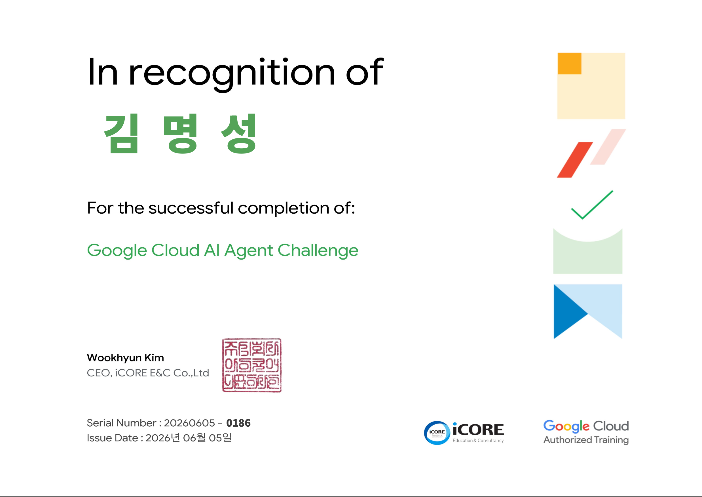

# 🧑🏻‍💻 김명성 | Myeongseong Kim

### AI Developer · Machine Learning · Problem Solving

> Turning AI ideas into practical software solutions.

---

## 🎓 Highlights

- 🥈 Google AI Agent Challenge 2026 **우수상 수상**
- 🏅 Solved.ac **Gold V**
- 🧪 T-LAB (Technology Startup Advanced Lab)
- 🎓 Handong Global University · AI Computer Engineering

<!--
## 🏅 Google AI Agent Challenge 2026

### Finalist Certificate

  

Google Cloud AI Agent Challenge 2026 본선 진출

---
-->

<!--
## 🏅 Problem Solving

---
-->

## 📫 Contact

- 📧 Email : proudchris@icloud.com
- 📝 Blog : https://drum-computer.tistory.com/
- 💼 LinkedIn : https://www.linkedin.com/in/myeongseong-kim-b87038402

---

